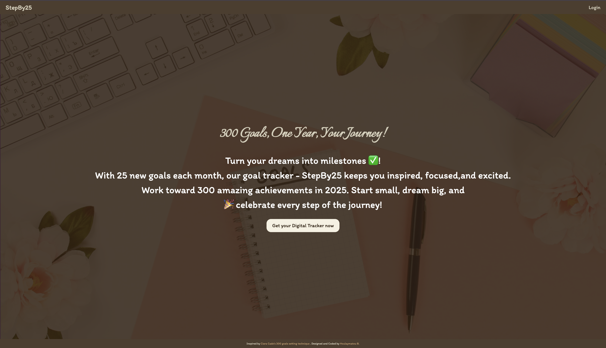

# 🎯 StepBy25 - Your 2025 Goals Tracker ✅



🎯 **StepBy25** is a digital goal tracker designed to help you set, achieve, and reflect on your goals like never before. The app encourages you to set up to **25 goals per month** with the ultimate aim of completing **300 goals per year**.

---

## Features ✨

- **Goal Setting**: Set and track up to 300 goals for the year
- **Monthly Planning**: Organize goals into monthly chunks of 25
- **Progress Tracking**: Monitor completion status and milestones
- **Reflections**: Document growth and memorable moments
- **Responsive Design**: Works seamlessly across all devices

---

## Tech Stack 🛠️

### **Frontend 🎨:**

- **React**: For building the user interface.
- **CSS Modules**: For styling each component modularly.

### **Backend 🂠:**

- **Firebase**: For real-time database and serverless backend.

### **Authentication 🔐:**

- **Firebase Authentication**: For secure and seamless user login and signup functionality.

---

## How to Run the Project 🚀

### **Prerequisites:**

- Node.js installed on your system.
- Firebase account for configuration.

### **Steps to Run:**

1. Clone the repository:

```bash
   git clone https://github.com/yourusername/StepBy25.git
```

2. Navigate to the project directory:

```bash
cd goals_tracker
```

3. Install dependencies:

```bash
npm install
```

4. Create a .env file in the root directory and add your Firebase configuration:

VITE_FIREBASE_API_KEY=your_api_key  
VITE_FIREBASE_AUTH_DOMAIN=your_auth_domain  
VITE_FIREBASE_PROJECT_ID=your_project_id  
VITE_FIREBASE_STORAGE_BUCKET=your_storage_bucket  
VITE_FIREBASE_MESSAGING_SENDER_ID=your_sender_id  
VITE_FIREBASE_APP_ID=your_app_id

5. Start the development server

```
npm run dev
```

6. Open your browser and navigate to your localhost, and voilà! 🎉

---

## Deployed Version 🌐

- You can check out the deployed version of the app here:
  [StepBy25](https://stepby25.vercel.app/) 🎯
- Watch the walkthrough of the project on YouTube: [StepBy25 on YT](https://youtu.be/8nj6jFpz6uM?si=rVNdv4uoizTXnn0J) 🎥

---

## Feedback 💬

I’d love to hear your feedback and suggestions! Feel free to reach out to me on [LinkedIn](https://www.linkedin.com/in/houlaymatoub/) or [Instagram](https://www.instagram.com/code_techhb)

---

## Future Enhancements 💡

- **Data Encryption**: Implement encryption for notes and goals to enhance user privacy.
- **Push Notifications**: Notify users of pending goals as reminders.
- **Progress Insights**: Add visual graphs to show user progress monthly and yearly.

## Acknowledgments 🙏🏾

- Special thanks to Ciara Cade for inspiring the idea with her 300-goal setting technique.

---

Built with ❤ by Houlaymatou B.
